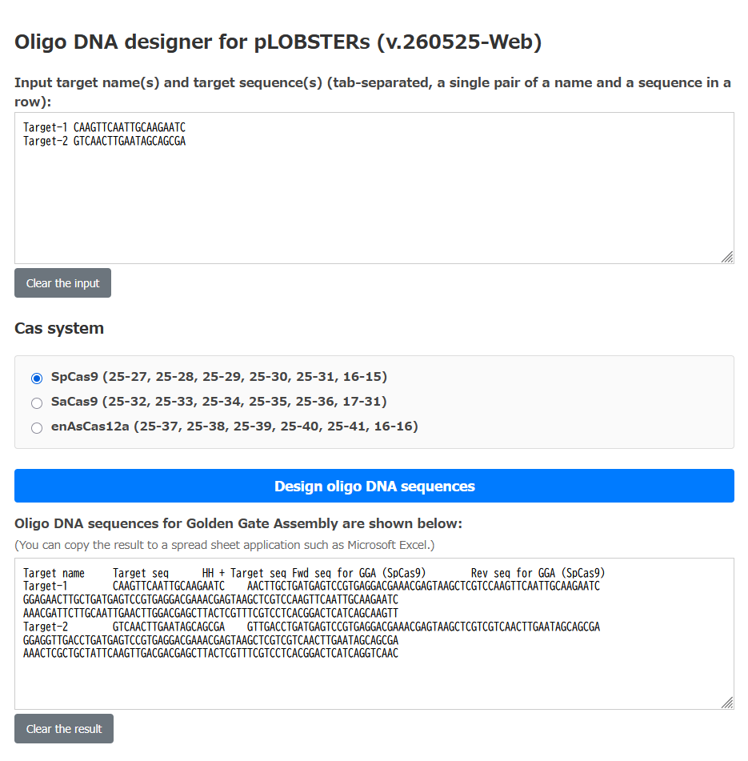

## LOBSTERS
**L**eague **O**f **B**ackbone plasmid vector **S**eries **T**o **E**xpand the **R**ange of **S**election markers for genome editing in <I>Saccharomyces cerevisiae</I>

## An expanded series of genome editing plasmid vectors for budding yeast.
Features of the plasmid series are:
- Three Cas systems (SpCas9, SaCas9, and enAsCas12a) are available.
- A Cas gene and the cognate sgRNA/crRNA gene are encoded on a single centromeric plasmid.
- The target sequence can be inserted by the Golden Gate Assembly.
- The expression of the Cas gene and/or the sgRNA/crRNA gene are under the control of the <I>GAL1</I> promoter.
- Seven marker genes (<I>KanMX</I>, <I>HphMX</I>, <I>NatMX</I>, <I>HIS3</I>, <I>TRP1</I>, <I>LEU2</I>, and <I>URA3</I>) are available.

## Available plasmids
|  Number  | Plasmid name                 | Cas type     |  Marker gene  |
| -------- | ---------------------------- | ------------ | ------------- |
|  25-27   | pLOBSTER-SpCas9-Kan(empty)   |  SpCas9      | <I>KanMX </I> |
|  25-28   | pLOBSTER-SpCas9-Hyg(empty)   |  SpCas9      | <I>HphMX </I> |
|  25-29   | pLOBSTER-SpCas9-Nat(empty)   |  SpCas9      | <I>NatMX </I> |
|  25-30   | pLOBSTER-SpCas9-His(empty)   |  SpCas9      | <I> HIS3 </I> |
|  25-31   | pLOBSTER-SpCas9-Leu(empty)   |  SpCas9      | <I> LEU2 </I> |
|  16-15   | pLOBSTER-SpCas9-Ura(empty)   |  SpCas9      | <I> URA3 </I> |
|  39-46   | pLOBSTER-SpCas9-Trp(empty)   |  SpCas9      | <I> TRP1 </I> |
|  25-32   | pLOBSTER-SaCas9-Kan(empty)   |  SaCas9      | <I>KanMX </I> |
|  25-33   | pLOBSTER-SaCas9-Hyg(empty)   |  SaCas9      | <I>HphMX </I> |
|  25-34   | pLOBSTER-SaCas9-Nat(empty)   |  SaCas9      | <I>NatMX </I> |
|  25-35   | pLOBSTER-SaCas9-His(empty)   |  SaCas9      | <I> HIS3 </I> |
|  25-36   | pLOBSTER-SaCas9-Leu(empty)   |  SaCas9      | <I> LEU2 </I> |
|  17-31   | pLOBSTER-SaCas9-Ura(empty)   |  SaCas9      | <I> URA3 </I> |
|  39-48   | pLOBSTER-SaCas9-Trp(empty)   |  SaCas9      | <I> TRP1 </I> |
|  25-37   | pLOBSTER-enAsCas12a-Kan(empty)|  enAsCas12a  | <I>KanMX </I> |
|  25-38   | pLOBSTER-enAsCas12a-Hyg(empty)|  enAsCas12a  | <I>HphMX </I> |
|  25-39   | pLOBSTER-enAsCas12a-Nat(empty)|  enAsCas12a  | <I>NatMX </I> |
|  25-40   | pLOBSTER-enAsCas12a-His(empty)|  enAsCas12a  | <I> HIS3 </I> |
|  25-41   | pLOBSTER-enAsCas12a-Leu(empty)|  enAsCas12a  | <I> LEU2 </I> |
|  16-16   | pLOBSTER-enAsCas12a-Ura(empty)|  enAsCas12a  | <I> URA3 </I> |
|  39-47   | pLOBSTER-enAsCas12a-Trp(empty)|  enAsCas12a  | <I> TRP1 </I> |

Plasmid sequence data are available from the link: [Plasmid sequences in SnapGene format](https://github.com/poccopen/LOBSTERS/tree/main/pLOBSTERs_SnapGene)

## Web application for gRNA oligo DNA design
Oligo DNA sequences for Golden Gate Assembly (GGA) can be automatically designed using our web-based tool. It runs entirely on the client side (inside your web browser) via PyScript/WebAssembly, meaning **no local installation or external tool download is required**. Your sequence data is safe and never uploaded to any external server.

### 🚀 Online Access (GitHub Pages)
You can access the application directly via the following link:
**[👉 Run gRNA Oligo Designer Online](https://poccopen.github.io/LOBSTERS/)**

*(Note: If you prefer a completely offline environment, you can also download the `gRNA_oligo_designer_for_pLOBSTERs_260525.html` file from this repository and open it directly in any web browser.)*

### 🛠️ How to Use
1. Input your target sequence data into the input text box.
   - The data must be formatted as **tab-separated** lines, with a single pair of a target name and a sequence per row.
2. Select your target **Cas system** from the radio buttons (`SpCas9`, `SaCas9`, or `enAsCas12a`).
3. Click the **"Design oligo DNA sequences"** button.
4. The designed forward and reverse oligo sequences will appear in the result field. You can directly copy and paste the output lines into spreadsheet applications like Microsoft Excel for oligo ordering.

